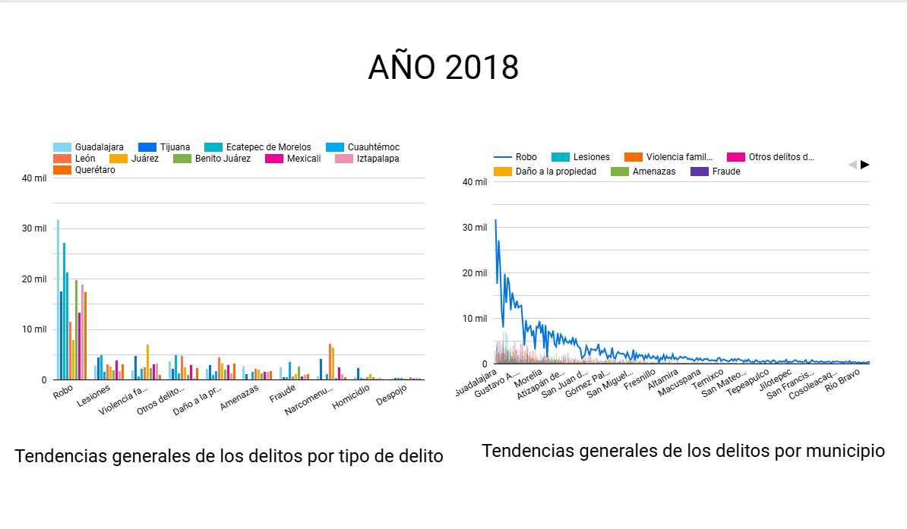

# Analisis_riesgo

## Objetivo
Medir el riesgo de delitos automovilísticos en municipios de México para optimizar los precios de seguros

# Proyecto Final - Analista de Datos

Este repositorio contiene el análisis de datos de delitos municipales en México, con el propósito de identificar los municipios de mayor riesgo para ajustar los precios de las pólizas de seguros de manera competitiva y rentable.

## Tabla de Contenidos
- [Introducción](#introducción)
- [Descarga y Creación de la Base de Datos](#descarga-y-creación-de-la-base-de-datos)
- [Conexión a la Base de Datos desde Python](#conexión-a-la-base-de-datos-desde-python)
- [Limpieza y Transformación de los Datos](#limpieza-y-transformación-de-los-datos)
- [Visualizaciones en Looker Studio](#visualizaciones-en-looker-studio)
- [Análisis de Series de Tiempo](#análisis-de-series-de-tiempo)
- [Clasificación de Estados por Peligrosidad (Clustering)](#clasificación-de-estados-por-peligrosidad-clustering)
- [Conclusiones y Recomendaciones](#conclusiones-y-recomendaciones)
- [Mejoras Futuras](#mejoras-futuras)

## Introducción
**Contexto del Proyecto:** El análisis busca identificar los municipios con mayor riesgo de delitos relacionados con automóviles. Esto es crucial para ajustar los precios de las pólizas de seguros de manera competitiva y rentable.

**Incidencia de delitos y determinación del riesgo:** La incidencia de delitos aumenta el riesgo de siniestros, lo que justifica la necesidad de ajustar el costo del seguro en función de este riesgo.

## Descarga y Creación de la Base de Datos
**Descarga de los datos:** Los datos de delitos se obtuvieron desde la [plataforma oficial de datos abiertos de México](https://datos.gob.mx/busca/dataset/incidencia-delictiva-del-fuero-comun-a-nivel-municipal).

**Creación de la base de datos en SQL:** Se creó una base de datos en SQL para almacenar y procesar los datos de manera eficiente.

## Conexión a la Base de Datos desde Python
Se estableció una conexión desde Python a la base de datos, lo cual permitió ejecutar consultas como:
- Visualización del nombre de las tablas existentes dentro de la base de datos.
- Obtención del número total de filas en una tabla específica.
- Filtrado de filas para el año 2016.

## Limpieza y Transformación de los Datos
**Resultado esperado:** Obtener un dataset limpio con formatos correctos y sin valores nulos, o con valores imputados adecuadamente.

## Visualizaciones en Looker Studio
Se generaron visualizaciones en Looker Studio para presentar un tablero interactivo con los hallazgos del análisis, facilitando la toma de decisiones basada en datos.

[Link al tablero de Looker Studio](https://lookerstudio.google.com/u/0/navigation/reporting)

### Año 2015

### Año 2016

### Año 2017

### Año 2018

### Año 2019

### Año 2020

### Año 2021

## Análisis de Series de Tiempo
**Objetivo:** Identificar patrones y tendencias en los delitos desde 2015 hasta 2021 y realizar predicciones para el año 2022.

**Selección del Municipio:** Para el análisis, se seleccionó un municipio con un volumen significativo de delitos, lo que facilita la identificación de tendencias y patrones. 

**Código para Series Temporales y Predicción usando Prophet:**
1. Instalación de Prophet.
2. Ajuste del modelo a los datos históricos para generar predicciones de los próximos 12 meses (2022).
3. Visualización:
   - **Línea azul:** tendencia de delitos entre 2015 y 2021.
   - **Línea punteada:** predicciones para 2022.
   - **Bandas grises:** intervalos de confianza.

## Clasificación de Estados por Peligrosidad (Clustering)
**Objetivo:** Clasificar los estados según su peligrosidad en 2021, aplicando algoritmos de clustering como **K-Means** y utilizando variables como el número total de delitos por año, tipo de delito y población.

## Conclusiones y Recomendaciones

### Análisis Exploratorio
- **Delitos por Año:** Hay un patrón de incremento general en el número de delitos reportados de 2015 a 2021 en ciertos municipios, lo que refleja un aumento de la actividad delictiva en varios estados.
- **Picos estacionales:** Algunos tipos de delitos muestran picos en meses específicos. Es interesante examinar si estos picos corresponden a eventos estacionales o festividades.
- **Municipios más afectados:** Municipios como los del Estado de México, Jalisco y Ciudad de México destacan por sus altos niveles de delitos a lo largo de los años.
- **Categorías de Delitos:** Los delitos más reportados son aquellos relacionados con robo de vehículo automotor, robo a negocio, y lesiones dolosas.

### Análisis de Series Temporales
- **Tendencias Generales:** Las series de tiempo muestran un aumento gradual en el número de delitos reportados, lo que podría indicar un empeoramiento de la seguridad en ciertos municipios. 
- **Predicción para 2022:** Usando modelos de series de tiempo como **ARIMA** o **Prophet**, se predice un aumento continuo en delitos en varios municipios clave.

### Clustering y Clasificación de Estados
- **Hallazgo principal:** Contraste entre estados con altos niveles de delincuencia, como el Estado de México y Baja California, y estados con menos delitos reportados, como Yucatán.

### Hallazgos Clave
- **Zonas de alta delincuencia:** Los municipios dentro del Estado de México, Jalisco y Ciudad de México son los más peligrosos en términos de volumen de delitos.
- **Patrones estacionales y temporales:** Aumentos de delitos en ciertos meses, posiblemente relacionados con eventos locales o festividades.
- **Tendencias al alza:** La criminalidad parece estar aumentando de forma consistente en algunos estados.

### Recomendaciones
- **Monitoreo de municipios críticos:** Dado que municipios como Ecatepec y Nezahualcóyotl reportan un aumento notable de delitos, se recomienda concentrar esfuerzos y recursos en estas áreas.
- **Optimización de recursos policiales:** Ajustar la asignación de recursos policiales para enfocarse en períodos críticos.
- **Mejorar la calidad de los datos:** Se sugiere monitoreo y actualización regular de los datos para mejorar la precisión del análisis.
- **Uso de técnicas de predicción:** Implementar modelos predictivos para anticiparse a posibles aumentos en la delincuencia.

## Mejoras Futuras
- **Agregar más variables:** Incluir más variables contextuales como nivel socioeconómico, tasa de empleo, o número de policías por habitante para enriquecer el análisis.
- **Integración con otros sistemas de datos:** Combinar datos adicionales sobre denuncias no registradas o tasas de arresto para una visión más completa.
- **Automatización del análisis:** Establecer pipelines de análisis automatizados para detección temprana de picos de delitos o cambios significativos en las tendencias.

## Conclusiones
- **Crecimiento de la criminalidad:** Los delitos en algunos municipios y estados están aumentando, lo que es motivo de preocupación.
- **Diferencias regionales:** Existen variaciones claras entre municipios y estados en cuanto al nivel de peligrosidad.
- **Herramientas de visualización:** Herramientas como Looker Studio permiten crear dashboards dinámicos para monitorear los niveles de delincuencia en tiempo real y apoyar la toma de decisiones.

---

> *Este proyecto demuestra cómo el análisis de datos puede ayudar a gestionar riesgos y a desarrollar estrategias de precios en seguros.*

(ver archivos adjuntos con más detalle).
